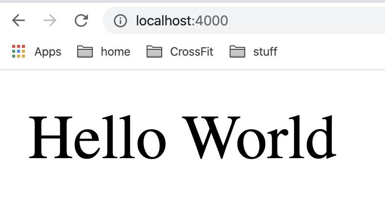

# PHP App

A sample PHP application with connectivity to a
postgres database


## Installation

To run this project, you need to PHP and a command line.
My environment (Mac OSX) comes with both already, if
yours does not, please submit a PR showing how you got
that up and running.

This was tested on `PHP 7.3`

```bash
php --version
```

The output should show something similar to

```bash
PHP 7.3.9 (cli) (built: Nov  9 2019 08:08:13) ( NTS )
Copyright (c) 1997-2018 The PHP Group
Zend Engine v3.3.9, Copyright (c) 1998-2018 Zend Technologies
```

## Running

To start the PHP server, run the following from
the root of the project.

```bash
(cd public && php -S localhost:4000)
```

The output should look similar to

```bash
Listening on http://localhost:4000
Document root is /Users/aforward/sin/projects/current/professor-forward/phpapp/public
Press Ctrl-C to quit.
```

And now you can open in a browser, your (first?) PHP web app.

[http://localhost:4000](http://localhost:4000)

The output should look similar to

