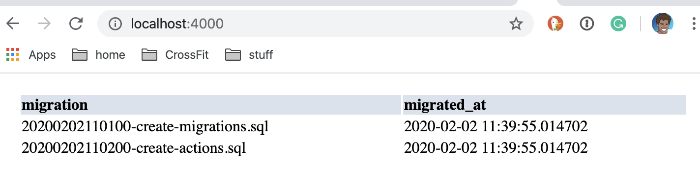

# PHP App

A sample PHP application with connectivity to a
postgres database


## Installation

### PHP 7.3+

To run this project, you need to PHP and a command line.
My environment (Mac OSX) comes with both already, if
yours does not, please submit a PR showing how you got
that up and running.

This was tested on `PHP 7.3`

```bash
php --version
```

The output should show something similar to

```bash
PHP 7.3.9 (cli) (built: Nov  9 2019 08:08:13) ( NTS )
Copyright (c) 1997-2018 The PHP Group
Zend Engine v3.3.9, Copyright (c) 1998-2018 Zend Technologies
```

### Postgres 11+


#### Postgres Server

The application (will soon) connect to a postgres database.
You will need to install that locally.

This was tested on `PostgreSQL 11.5`

```bash
psql --version
```

The output should show something similar to

```bash
psql (PostgreSQL) 11.5
```

#### phpapp database

We will need a database `phpapp` created.

```bash
psql -c "create database phpapp"
```

Now let's load the schema

```bash
psql -d phpapp -f ./db/schema.sql
```

Let's test it out.

```bash
psql phpapp
```

The output should look similar to

```bash
psql (11.5, server 11.6)
Type "help" for help.

phpapp=#
```

Let's run a few queries against our database.

```sql
phpapp=# \dt+
```

We should see three tables, like

```
                            List of relations
 Schema |       Name        | Type  |  Owner   |    Size    | Description
--------+-------------------+-------+----------+------------+-------------
 public | actions           | table | aforward | 8192 bytes |
 public | clients           | table | aforward | 8192 bytes |
 public | schema_migrations | table | aforward | 8192 bytes |
(3 rows)
```

Let's look at the data within the `schema_migrations` table.

```sql
phpapp=# select * from schema_migrations;
```

The output should look similar to:

```
              migration               |        migrated_at
--------------------------------------+----------------------------
 20200202110100-create-migrations.sql | 2020-02-02 11:39:55.014702
 20200202110200-create-actions.sql    | 2020-02-02 11:39:55.014702
 20200322173700-create-clients.sql    | 2020-03-22 18:15:50.238449
(3 rows)
```

#### seeding database

You can run the following to insert some sample data into your database.

```sql
INSERT INTO clients
  (name, data)
VALUES
  ('Big Co.', '{"credits": 100}'::json),
  ('Small Co.', '{"credits": 100}'::json);
```

You can verify the automatically generated tokens, for example:

```sql
SELECT name,
       token,
       data
FROM clients;
```

Returning something similar to:

   name    |              token               |       data
-----------+----------------------------------+------------------
 Big Co.   | d7d85f7eac7360d725b44d327445473e | {"credits": 100}
 Small Co. | 9f8983a8494c8a003e064374ffb77cb6 | {"credits": 100}


## Running

To start the PHP server, run the following from
the root of the project.

```bash
(cd public && php -S localhost:4000)
```

The output should look similar to

```bash
Listening on http://localhost:4000
Document root is /Users/aforward/sin/projects/current/professor-forward/phpapp/public
Press Ctrl-C to quit.
```

And now you can open in a browser, your (first?) PHP web app.

[http://localhost:4000](http://localhost:4000)

The output should look similar to




## Troubleshooting

### Already have a phpapp database?

If you see

```
ERROR:  database "phpapp" already exists
```

That means you already have that database.

If you previously installed this sample application and
want to start fresh, then you will probably want to
drop the existing database first.

```bash
psql -c "drop database phpapp"
```

Now you should be able to follow the instructions above
to create your phpapp database.

### Unable to connect to database?

You might see several warnings or errors, please read them

```
Warning: pg_connect(): Unable to connect to PostgreSQL server:
FATAL: database "phpapp" does not exist in
phpapp/public/index.php on line 3

Warning: pg_query() expects parameter 1 to be resource,
bool given in phpapp/public/index.php on line 4

Warning: pg_fetch_all() expects parameter 1 to be resource,
null given in phpapp/public/index.php on line 5
```

Follow the instructions and make sure your database is
properly setup.  If you are connecting to a remote database,
then you will need to update the connection string with
the correct values.

